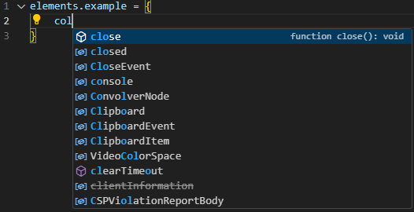
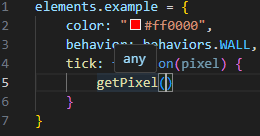
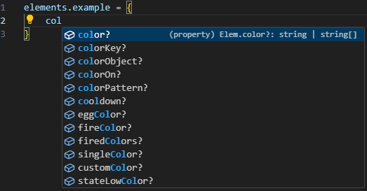
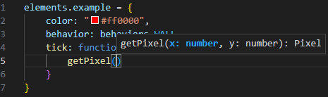

# Using Type Definitions in Sandboxels Mods

**Disclaimer:**  
This is **not full TypeScript support**.  
The `.d.ts` file only provides **parameter hints, autocomplete, and available properties** in element definitions.  
It will not catch all type errors or enforce strict type checking.

---

## Features

- See function parameters while writing mods  
- Autocomplete for properties inside element definitions  
- Helps reduce constant lookups and guesswork  

---

## Notes

- The `.d.ts` file is **incomplete** (work in progress)  
- Some functions and properties are missing  
- Contributions and suggestions are welcome!  

---

## Setup
1. Create a folder named `types` and place a copy of `sandboxels-types.d.ts` inside.
2. Add a `jsconfig.json` at the root (e.g. sandboxels-main) to enable IntelliSense across your mods.
3. Open your project in VS Code (or any editor with IntelliSense). Hints and autocomplete should now appear.

---

## Example Result
Before .d.ts integration

After .d.ts integration

---

## Contributing

Want to help improve this? You can:  
- Add missing functions or properties  
- Improve type accuracy  
- Suggest better organization  

Pull requests and issues are always appreciated!  
